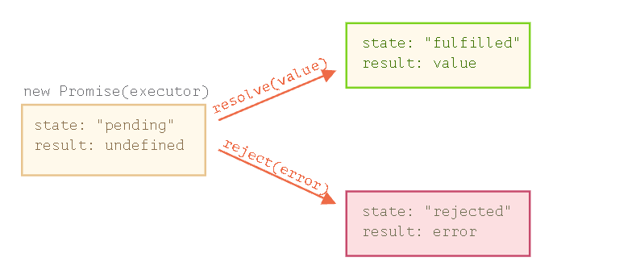

 # Что такое метатеги?

 Это теги внутри head , которые не влияют на содержимое на странице не отрисосывают, в основном используются для seo

 # Что описывается в head? 

 - Тег title основной заголов
 - Метат теги для кодировки, ключевых слов и т.д 
 - Путь к таблице стилей через <link>
 - Использются скрипты через <src> или <script>

 # Что описывается в head? 