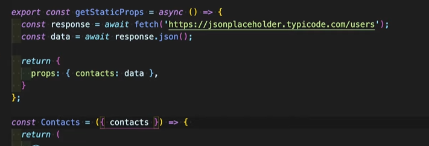
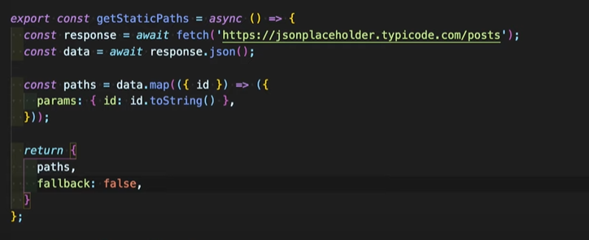

# Что такое NextJS

Это фреймворк написанный для реакт приложения. Основная задача фреймворка увеличение скорости загрузки сайта и SEO оптимизация.  И вместо пустой страницы при рендере обычного реакта мы получаем полную html страницу 

# Преимущества NextJS

- Генирация полной HTML страницы со всеми тегами 
- SEO оптимизация 
- Возможность прирендеринга SSR (server side rendering) и SSG (static site generetion) много автоматических страниц 
- Простота создания страниц и роута

# Создание страниц и роутинга

Для создания страниц достаточно в папке pages создать страницу с определенным название.

        ./pages/contact.js

Если нам нужна высокая вложенность мы можем создать папку со страницей например 
            
            ./pages/contacts/jack 

Если мы хотим создать свою страницу ошибку просто достаточна создать файл 404.js уже со своей разметкой 

            ./pages/404.js

# Макет и компоненты (Layout & Components)

Компаненты создаются точно так же как и в классическом реакт приложении. 
Для создании Layout мы можем использовать следующий подход:
- Создание компаненты Footer
- Создание компаненты Header
- Создание компаненты Layout со следующей разметкой 

        cont Layout ({chliden}) => (
            <>
            <Header/>
            {chliden}
            <Footer/>
        )

- После чего оборачиваем Component в корневом файл app.js и получаем классический Макет сайта с хедером и футером 

        <Layout>
         <Component>
         <Layout>

# Навигация по страницам (Pages Navigation & Redirecting)

Для создание ссысок в классический приложениях мы используем тег <a> с атрибутом href, ссылка выглядит как <a href='www.google.com'>

В next.js Для это испозьуется тег <Link> где внутри мы указываем адресс необохоимой нам ссылки 

# Стили
Поддерживаются все варианты стилей такие как :
- Css модули css.module.css
- Препроцесорры Less, sass, etc...
- Style components 

Для установки препроцессора испоьльщуем npm install sass

Чтобы добавить стили к компаненту используется следующий подход 
- создаем файл стиля используя модульный подход и препроцессоры, где и прописываем нами стили 
- после чего импортируем файл стилей и в класснейм дабавляем необходимый стиль 

## Картинки и метаданные (Images & Metadata)

# Получение данных (Fetching Data)

Для получения данных мы можем использовать обычный fetch запрос, но тогда запрос будет происходить на стороне клиента 

Поэтому для этого есть специальная функция getStaticPorps 
Особенность в том как мы получаем данные:
- Полученные данные мы возвращаем через return {props : {contacts:data}}
- После полученные данные мы передаем в компонент в качестве пропсов 

Для поиска ошибок используется конструкция 

# Динамические роуты (Dynamic Routes)

Для создание динамического роута нужно чтобы имя страницы было обернуто в квадратные скобки 

                contacts/[id.js]

# Рендеринг на сервере и статичная генерация  SSR & SSG
 Для получения данных на динамических страницах лучше использовать метод getServerSideProps и в качетсве агрумента получает объект {context}

 Для создание динамиечских страниц и хапроса данных для них используем метод getStaticPath.Рассмотрим все детальнее: 
 - Получаем даннные при аиснхронном fetch запросе
 - После итерируемся по массивы путей через map 

 

 # Создание API (API Creation)

Мы можем создавать собственные API для этого есть папка api

# Подключение TypeScript 
 Мы можем подключить TS сразу как только мы создаем проект добавив лишь флаг 
 npm create-next-app --ts

Последовательность действий:
1. Типизируем наш объект 
2. Для вложенного объекта создаем свой тип и присваеваем его к нужной строке 
3. Импортируем наши типы, и для пропсов создаем тип, который мы орпеделили во внешнем файле types.ts 
4. Так как мы используем функциональные компаненты то мы экспортируем FC и определяем тип для наших пропсов из 3 пункта 

 

 ##### Типизация для компанента используещего children 

 1. В перую очередь экспортируем FC (так используем функциональный компанент) и ReactNode (для children)
 2. Опреляем тип для напих пропсов. Так у нас принимается children типом для него является ReactNode 
 3. Типизируем нам компанент FC<PropsType>

  

   ##### Типизация функций SSR SSG
Для SSR:
   1. Мы экспортируем GetServerSideProps из NEXT и применяем к нашей функции 
   2. Применяем к нашей функции 

  

  Соответсвенно также для всех функций исполльзуемых NEXT.js 
  - Для getStaticProps используем {GetStaticprops} from next
    - Для getServerSideProps используем {GetServerSideProps} from next

     ##### Типизация API
     Для типизации API также сущесвуют определенные типы **NextApiRequset** и **NextApiResponset** from 'next'  и все что нужно сделать это лишь добавить эти типы для нашей функции 

       

##### Типизация главной страницы 
1. Экспортируем {AppProps} from 'next'
2. Применяем к пропсам основного приложения 

      