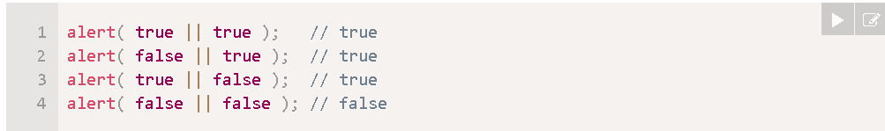

# Что такое поднятие состояния вверх (Lifting State Up)?

Это патерн когда состояние может использоваться сразу для нескольких компанентов. Иногда одни компаненты должны реагировать на одни и тежи события или изменения состояния и рекомендуем подход чтобы это сдалть - это поднять состояние вверх

# Разница между классовым и функциональным компонентами?

# Что такое синтетические события в React (SyntheticEvent)?