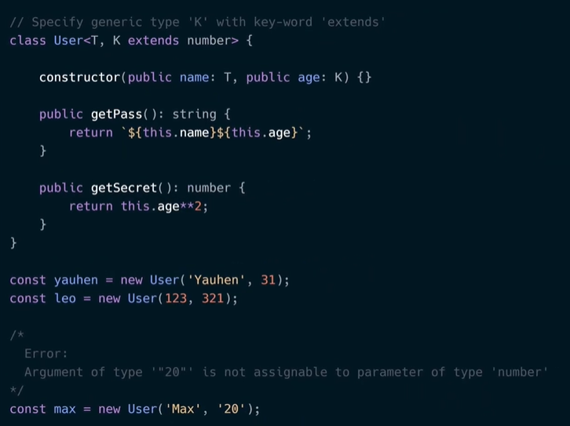

# Для чего нужен TypeScript ? 
- Позволяет упростить этап разработки, позволяя найти ошибку еще на этапе разработки 
- Позволяет типизировать входящие данные 
- Легко интегрируется в любой фреймворк и библиотеку 

# Типы данных TS 
Если мы хотим узнать тип в js вы можем использовать typeof 
В TS существует Basic types: 
- string 
- number 
- boolean 
- undefind
- null 
- symbol 
- bject 
- void (для функций,которые ничего не возвращают )

Более сложные типы:
- Array (существует два синтаксиса для определение)
     
     
- Typle используется для массивов разных типов данных также два вида записи 
        

- Any типы могут быть разные (лучше не использовать)

- Enum своего рода смесь массива и объекта (хорошо подходит для задания имен числовым значениям )
- Never используется если функция возвращает ошибку  и не заканчивает свое выполнение или в бесконечной функции 
- Object 
- Type свое рода элеас для определенных значений 

# Присвоение типа переменной 
Для присвоенние типа переменный мы используем следующий синтаксис:
- Инициализируем переменную черел let,const или var
- Назначаем ей имя 
- Через двоеточие указывает тип переменной 
- Через равно указываем значение 

                const sevenNumber: number = 7;

# Перечисления (Enums)
Своего рода смель объекта , где мы можем получить значение по ключу и наоборот ключ по его значние 

Например мы можем использовать enum для использования ссылок по определенным ключ значение 

# Функции 
Так как задача TS описание типов для всех возможных значений мы должны определеить тип как для функции так и для ее входяхий параметров 

        const Somefunction (name:string,age:number) => `${name}${age}`

Если один из агрументов может быть или стракой или числом мы также можем это зафиксировать через символ | (тип объединения)

        const Somefunction (name:string,age:number|string) => `${name}${age}`

Также мы можем использовать дфволтные аргмуенты. Это агрументы которые появились в синтексисе ES6 для того чтобы задать значения для агрументов, если они не были получены и задать им дефолтные(начальные значения )

Если существует ситуация когда один из агрументов может быть передан, а другой нет, то мы получим ошибку. Чтобы избежать ошибку мы можем пометить что один из агрументов ялвяется необязательным и может как быть так и отсутсвовать. Для этого мы используем вопроситьельный знак 

        const Somefunction (name:string, age?:number|string) => `${name}${age}`

##### Возвращаемые значения функции 
Мы должны также указывать тип не только для входящих значений но и для исходящих значение тоже. Иными словами нам также необходимо типизировать и результат который возвращает функция. Если функция ничего не возвращает использется тип void  

# Объекты
Так как объект содержит информацию ключа значение, мы должны через тип описывать хранящиеся в объекте значения. 

Но лучше для описания типов объектов использовать другую структуру данных называемой *type* 
В type мы описываеваем тип для значений и после нашему объекту указываем тип type 

# Классы
Для классов существует 4 определенных модификатора доступа:
1. Public (это значение по умолчанию) данный метод или свойство можно получить 
2. Private данный метод или свойство не может быть получен за пределами класса (не классы наследники, не объекты класса не могут получить доступ)
3. Protected доступ могут полчить только наследнки
4. Readonly доступный только для чтения 

###### Наследование 

###### Абстрактный класс 

**Информация может быть дополненна !!!**

# Пространства имён и модули 
Если мы хотим создать определенные констаны, и функции(называют утилиты) которые могут переиспользоваться, но при этом не создавать глобальные переменные можно использовать nameSpace. NameSpace это сущность поторая позволяет получить определенное значение или вызвать функциию которые в ней определены 

Для использвания утилит испольуется следующий синтаксис:
- Имортируем как на картинке <reference path-utils.js>
- Используем  

**Но для больших приложений или приложений на Реакт лучше использвать Module (это обычные импорты и экспорты определенных функций либо констант )!!!**

# Интерфейсы

# Отличе Interaface от Type

type задает псевданим для любой разновидности типа включая примитивы. Type - это механизм создания псевданима длю любого типа. В своб очередь Interface - это именнованый тип объекта, также интерфейс мы можем использовать в выржениях extends , implements. Тоесть Interface может наследовать и расширяться иными словами у interface горазда больше возможностей чем у type 

# Общие типы (Generic)
Позвозяет создавать компаненты которые могут работать с разными типами. 

Пример синтаксиса со стрелочными функциями и обычными 

Если мы хотим чтобы generic тип был конкретным типом данных мы должны использовать конструкцию <T extends number(string, boolean, etc)>

