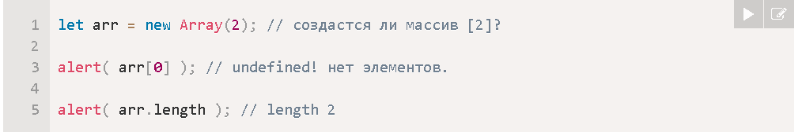
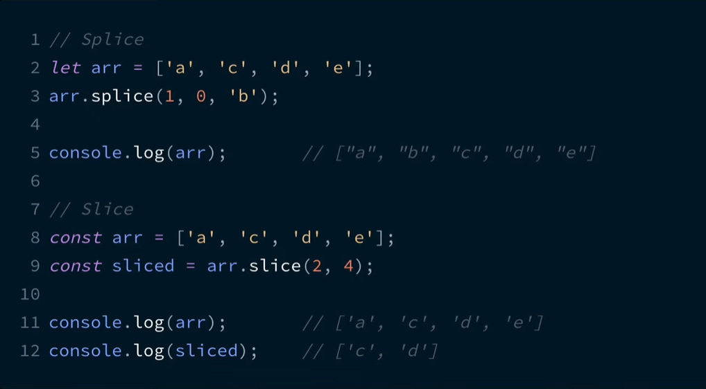

# Методы массивов #
let arr = ['Tommy','Artur','Jony'] 

## Cпособы создания массива

1. Через литереал 

        let arr = ['Tommy','Artur','Jony'] 

2.  Через new Array()

        let arr = new Array("Яблоко", "Груша", "и тд");

*Если new Array вызывается с одним аргументом, который представляет собой число, он создаёт массив без элементов, но с заданной длиной !!!!*

## Для добавления/удаления элементов:
- arr.push () - добавляет элементы в конец,
- arr.pop () - извлекает элемент из конца,
- arr.shift () - извлекает элемент из начала, 
- arr.unshift () -добавляет элементы в начало.
- arr.lenght - определяет длинну массива 

## Для поиска среди элементов:
- arr.indexof (',') - поиск указаного текста 
- arr.lastIndexOF ('a') -поиск последгего указанго символа 
- arr. slice (0,3) - создаёт новый массив, копируя в него элементы с позиции start до end (не включая end).
- splice(pos, deleteCount, ...items) – начиная с индекса pos, удаляет deleteCount элементов и вставляет items.
- concat(...items) – возвращает новый массив: копирует все члены текущего массива и добавляет к нему items. Если какой-то из items является массивом, тогда берутся его элементы.
- indexOf/lastIndexOf(item, pos) – ищет item, начиная с позиции pos, и возвращает его индекс или -1, если ничего не найдено.
- includes(value) – возвращает true, если в массиве имеется элемент value, в противном случае false.
- find/filter(func) – фильтрует элементы через функцию и отдаёт первое/все значения, при прохождении которых через функцию возвращается true.
- findIndex похож на find, но возвращает индекс вместо значения.

## Для перебора элементов:
- forEach(func) – вызывает func для каждого элемента. Ничего не возвращает.
- for для перебора массива 
- for in - ЛУЧШЕ НЕ ИСПОЛЬЗОВАТЬ ДЛЯ МАССИВА, он медленее 
- for of - не предоставляет доступа к номеру текущего элемента, только к его значению

## Для преобразования массива:
- map(func) – создаёт новый массив из результатов вызова func для каждого элемента.
- sort(func) – сортирует массив «на месте», а потом возвращает его.
- reverse() – «на месте» меняет порядок следования элементов на противоположный и возвращает изменённый массив.
- split/join – преобразует строку в массив и обратно.
- reduce(func, initial) – вычисляет одно значение на основе всего массива, вызывая func для каждого элемента и передавая промежуточный результат между вызовами.

## Особые методы :
- some - проверяет, удовлетворяет ли какой-либо элемент массива условию, заданному в передаваемой функции. Возвращает true\false. Если условия соответсвует хотя бы для одного элемента true, то конечный итог выведет true 
- every - проверяет, удовлетворяют ли все элементы массива условию, заданному в передаваемой функции.Возвращает true\false. Если условия соответсвует для всех элементов и дает нам true, то конечный итог выведет true. Но если хотя бы один элемент не соответсвует условию выведет false 

# Разница между методами slice() и splice()?
 - arr.slice(1,0,a) - используется для замены определенный элементов у массива. Данный метод имеет 3 параметра, первый параметр это элемент с которого мы будем произвоизводить замену и второй это по какой элемент мы будем производить замену, третий параметр это и есть значение заменяемого элемента  

- Метод arr.slice(1,3) возвращает новый массив, содержащий копию части исходного массива.Параметры это с какого по какой произвести копию массива 
