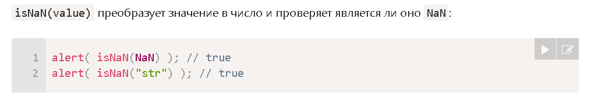
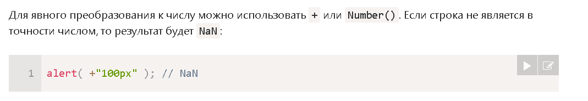

# Методы чисел

Math.floor - Округление в меньшую сторону: 3.1
Math.ceil - Округление в большую сторону: 3.1 
Math.round - Округление до ближайшего целого: 3.1 становится 3
Math.trunc - Производит удаление дробной части без округления: 3.1 становится 3
toFixed(n) - окургялет число до n после запятой 

        alert( sum.toFixed(2) )

parseInt - возвращает целое число

        alert( parseInt('100px') ); // 100

parseFloat - возвращает число с плавающей точкой

        alert( parseFloat('12.5em') ); // 12.5

Math.random() - Возвращает псевдослучайное число в диапазоне от 0 (включительно) до 1 (но не включая 1)

        alert( Math.random() ); // 0.1234567894322

Math.max(a, b, c...) / Math.min(a, b, c...) - Возвращает наибольшее/наименьшее число из перечисленных аргументов.

        alert( Math.max(3, 5, -10, 0, 1) ); // 5
        alert( Math.min(1, 2) ); // 1

Math.pow(n, power) - возводит число n в степень power 

        alert( Math.pow(2, 10) ); // 2 в степени 10 = 1024

 

 ## Преоброзование чисел 

  